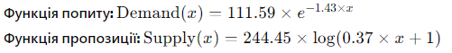
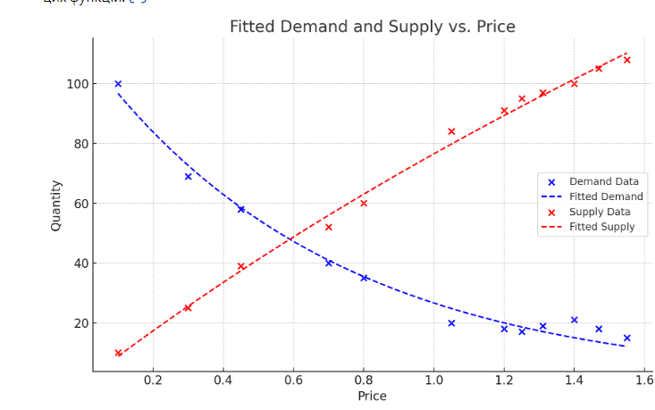
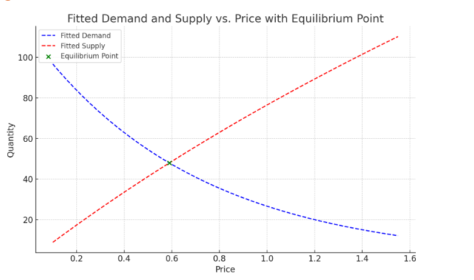
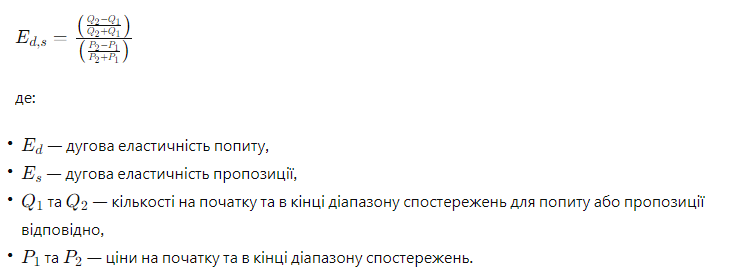
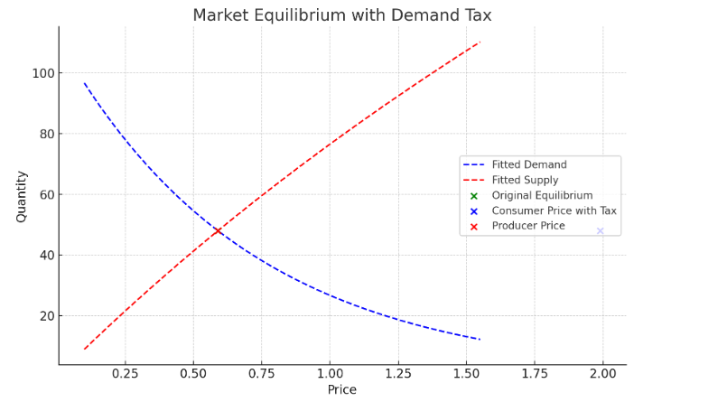

# **_TASK 1_**

Давайте визначимо експоненціальну функцію для попиту та логарифмічну функцію для пропозиції, а потім використаємо метод найменших квадратів для знаходження параметрів цих функцій.

Ці функції візуально добре описують наведені дані, де попит знижується зі зростанням ціни, а пропозиція зростає.

# _**TASK 2**_

Для знаходження точки ринкової рівноваги, нам потрібно знайти ціну та кількість, при яких функції попиту та пропозиції дорівнюють одна одній. Це означає, що ми повинні розв'язати рівняння:

111.59×e^(−1.43×x) =244.45×log(0.37×x+1)

де  x - це ціна в точці рівноваги. Розв'язавши це рівняння, ми зможемо знайти відповідну кількість, використовуючи одну з функцій.

Точка ринкової рівноваги була знайдена при ціні приблизно $0.59 з відповідною кількістю приблизно 48 одиниць. Ця точка позначена на графіку зеленим кольором.

Щодо стабільності рівноваги, якщо ми розглянемо невеликі зміни в ціні навколо точки рівноваги, можна побачити, що збільшення ціни призводить до зменшення попиту (як показано блакитною лінією) та збільшення пропозиції (червона лінія), що вказує на перевищення пропозиції над попитом. Аналогічно, зниження ціни призводить до збільшення попиту та зменшення пропозиції, що вказує на перевищення попиту над пропозицією.

Для дослідження стабільності ринкової рівноваги на Python, ми можемо аналізувати похідні функцій попиту та пропозиції в точці рівноваги. Стабільність рівноваги можна визначити через співвідношення між змінами кількості попиту та пропозиції відповідно до змін ціни. 

Ось як ми можемо це реалізувати:

Обчислити похідну функції попиту за ціною в точці рівноваги.
Обчислити похідну функції пропозиції за ціною в точці рівноваги.
Порівняти ці дві похідні.
У точці рівноваги похідна функції попиту за ціною дорівнює приблизно 
− 68.69 а похідна функції пропозиції за ціною дорівнює приблизно 73.85

# _**TASK 3**_

Дугова еластичність вимірює відсоткову зміну кількості, що попитується або пропонується, у відповідь на відсоткову зміну ціни між двома точками. Вона розраховується за формулою:

Ми вже маємо дані про ціни та кількості, тому можемо розрахувати дугову еластичність для попиту та пропозиції на всьому діапазоні спостережень.

Дугова еластичність попиту на всьому діапазоні спостережень дорівнює приблизно −0.84, а дугова еластичність пропозиції — приблизно 0.95.

Ці значення вказують на те, що попит є досить еластичним: зі збільшенням ціни на 1% кількість попиту зменшується приблизно на 0.84%. Пропозиція також є еластичною, зі збільшенням ціни на 1% кількість пропозиції зростає приблизно на 0.95%. Еластичність пропозиції вища за еластичність попиту, що вказує на більш чутливу реакцію пропозиції до змін цін у порівнянні з попитом на цьому діапазоні цін.

# _**TASK 4**_

Введення податку на попит впливає на ринкову рівновагу, зміщуючи криву попиту або пропозиції. Податок на попит фактично зменшує готовність споживачів платити за товар на суму податку. Це означає, що при будь-якій ціні кількість, яку попитуватимуть споживачі, зменшиться на суму податку.

Cпочатку визначимо вплив податку на ринкову рівновагу та покажемо це на графіку.

На графіку вище показано вплив введення податку на попит у розмірі $1.4 на ринкову рівновагу. Первинна точка рівноваги була зеленою, де рівноважна ціна без податку становила приблизно $0.59, а рівноважна кількість близько 48 одиниць.

Після введення податку ціна, яку платять споживачі (позначена синім), збільшується до приблизно $1.99, враховуючи податок на попит. Ціна для виробників (позначена червоним) залишається на рівні первинної рівноважної ціни без податку, $0.59.

Це ілюструє, що податок на попит підвищує витрати для споживачів, але не впливає на ціну, яку безпосередньо отримують виробники за проданий товар. Розрив між цими двома цінами являє собою величину податку/
